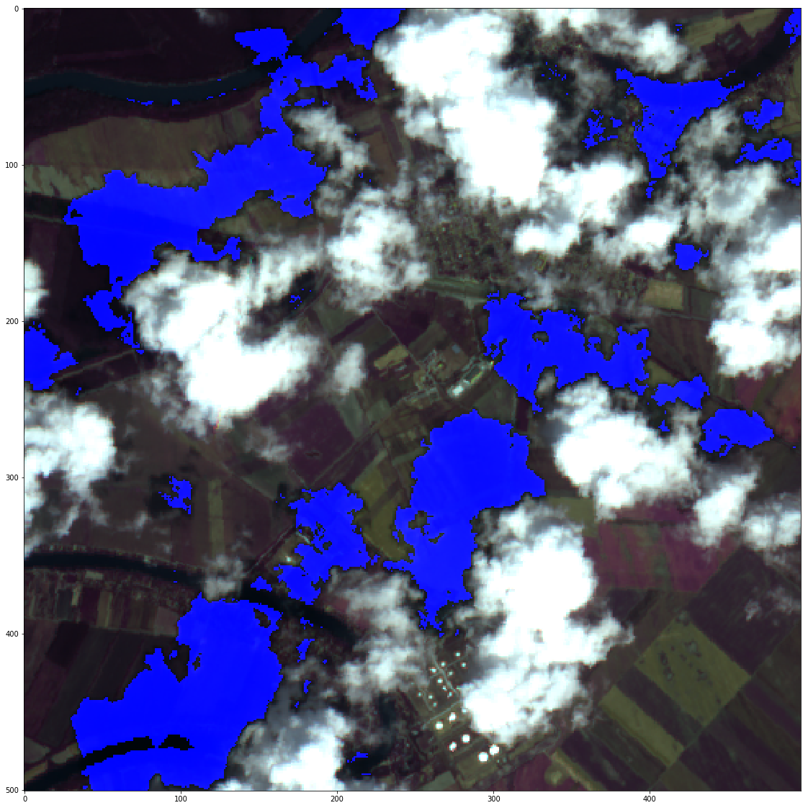

# CloudDetector

Public part of my satellite image processing pipeline.

Processing satellite images can be problematic due to atmospheric phenomenons like clouds, fog, shadows, etc. I had problems with [SentinelHub](https://www.sentinel-hub.com/) cloud mask so I decided to make one for myself. The filter was trained on data from the Sentinel-2 L1C dataset.

(The Sentinel-2 mission is a land monitoring constellation of two satellites that provide high resolution (mostly 10x10m) optical imagery. The mission provides a global coverage of the Earth's land surface every 5 days. L1C data are available from June 2015 globally.)

Description of files:
* [environment.yaml](environment.yaml) - Anaconda environment
  * Dependecies for both file. Pip install also required.
* [loader.ipynb](loader.ipynb) - How to download images from entire regions
  * Requirements, creating region of interest, dowloading from SentineHub.
  * [roi.geojson](roi.geojson) - Coordinates of Region of Interest(RoI).
* [cldetector.py](cldetector.py) - Cloud detection based on pixel-wise information
  * [pixelwise_v8_weights.hdf5](pixelwise_v8_weights.hdf5) - Model weights.

## How does it work?

1, Import cldetector.py
```
import cldetector as cld
```
2, Calculate temporal product from two previously taken image (same coordinates). Append temporal product to band data.
```
# img shape = (x, y, 13 band)
image_time_series = [img0, img1, img2]
std = np.std(image_time_series, axis=0)
temporal_product = np.sum(pixel_std, axis=2) * 2 / 13
```

3, Initialize an CloudDetector object by passing the input array. The input size should be (number of pixels, 14). The second index consist of 13 spectral band value plus one temporal product.
```
glassball = cld.CloudDetector(pixel_array)
```
4, Call the prediction function. output[i]: (land probability, cloud probability, shadow probability)
```
output = glassball.predict()
```
5, Call the update function in case of new data. Repeat step 4.
```
glassball.updateInput(new_pixel_array)
```

## Expected quality of predictions

A very small training set was used to train the model. I plan to update the model in the future (more data, 2D convolution layers, etc.).

V8 model (pixel)
The trained model works fairly well for classic clouds and cirrus. Few false detection expected on white structures. Fog usually partly detected. Bodies of water often mislabeled as shadow.

  
  
  
  

